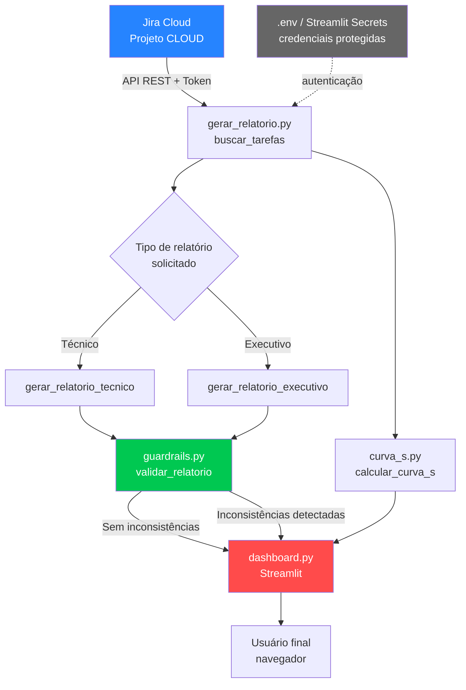

# Diagrama de Arquitetura — Copiloto de Gestão de Projetos

Este diagrama representa o fluxo de dados do sistema, desde a origem no Jira até a apresentação final ao usuário.

## Componentes

| Componente | Responsabilidade |
|---|---|
| **Jira Cloud** | Fonte de dados: tarefas, status, prazos e datas de conclusão |
| **gerar_relatorio.py** | Busca dados via API REST e gera os relatórios (técnico e executivo) |
| **curva_s.py** | Calcula o progresso acumulado planejado x realizado |
| **guardrails.py** | Valida se o relatório gerado é consistente com os dados de origem, prevenindo inconsistências |
| **dashboard.py** | Interface interativa (Streamlit) que orquestra os módulos e apresenta os resultados |
| **.env / Streamlit Secrets** | Armazenamento seguro de credenciais (token, e-mail, URL), nunca versionado no código |

## Fluxo resumido

1. O usuário escolhe o tipo de relatório desejado no dashboard
2. O sistema autentica-se no Jira usando credenciais protegidas
3. As tarefas do projeto são buscadas via API REST
4. Os dados são processados e transformados em relatório (técnico ou executivo) e/ou Curva S
5. O guardrail valida o relatório gerado contra os dados brutos, antes de exibi-lo
6. O resultado final é exibido ao usuário através do dashboard

---
*Diagrama elaborado como parte do projeto de portfólio "Copiloto de Gestão de Projetos com IA Generativa".*
